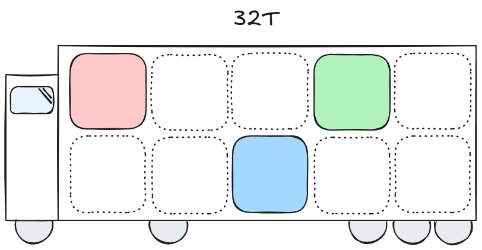

# AI Coursework

## Dependencies
```sh
pip install -r requirements.txt
```

## 1: Maximising & Minimising 1s
```sh
python3 task_1.py
```

Blue represents 1, green represents 0.

## 2: 4Core Logistics Ltd
```sh
python3 -m http.server -D Task2
```
or
```sh
cd Task2
python3 -m http.server
```
Navigate to `http://localhost:8080/`



## 3: Function Approximation
```sh
python3 task_3.py
```
the following task 3 shows a neural network aproximating a given function and also shows the mean squared average of the neural network

## 4: Diamond Prices
```sh
python3 task_4.py
```
